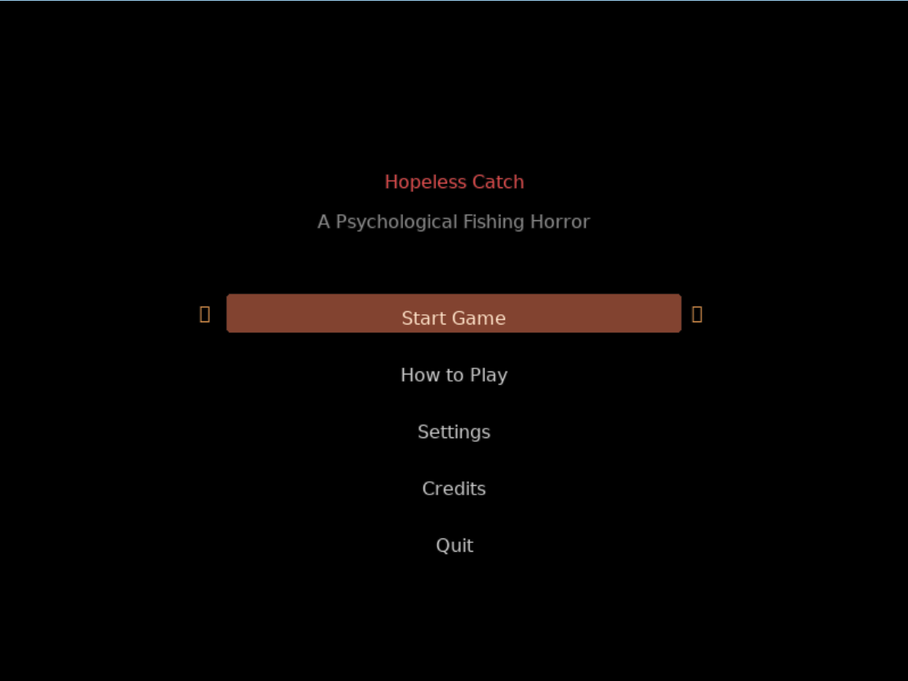
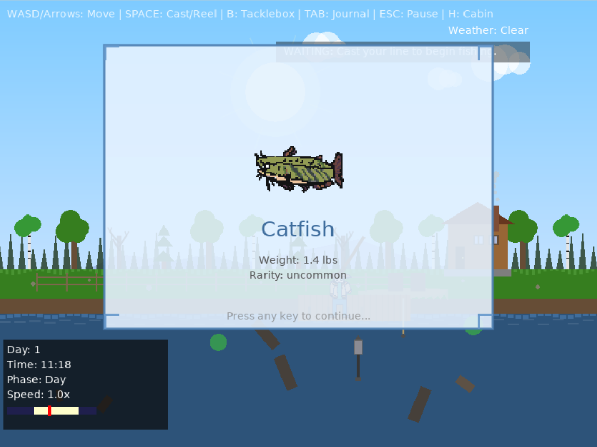
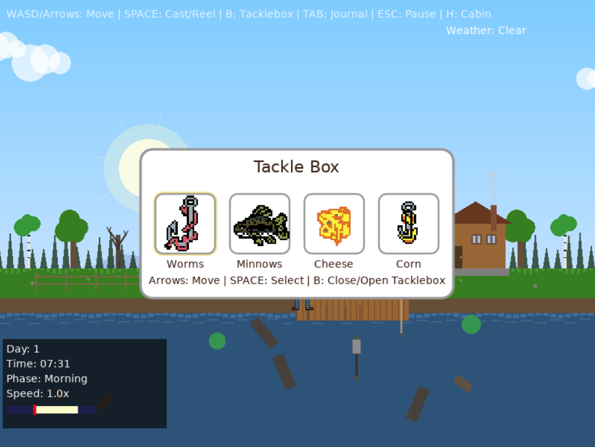
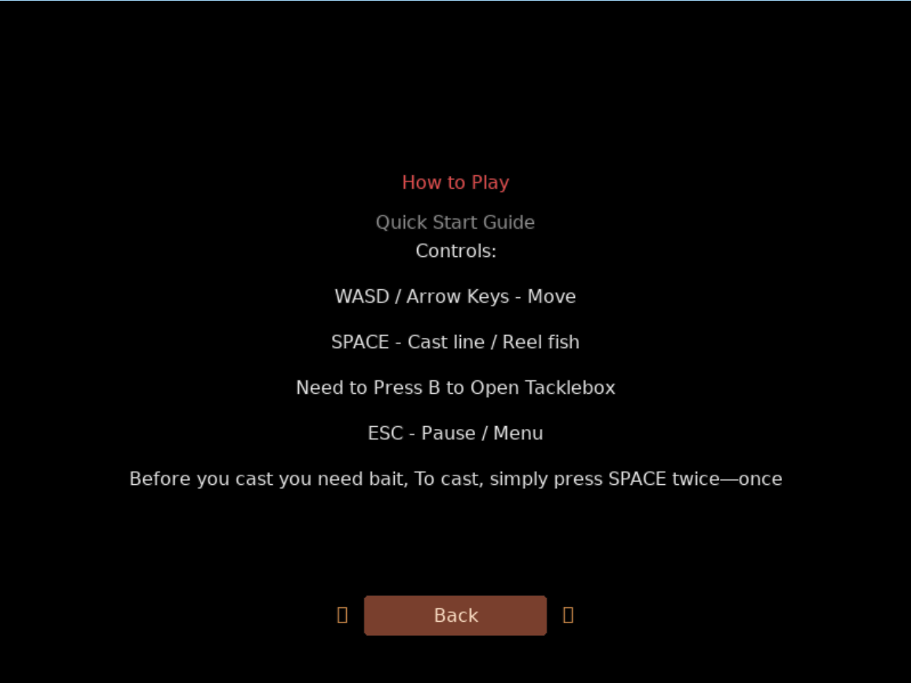
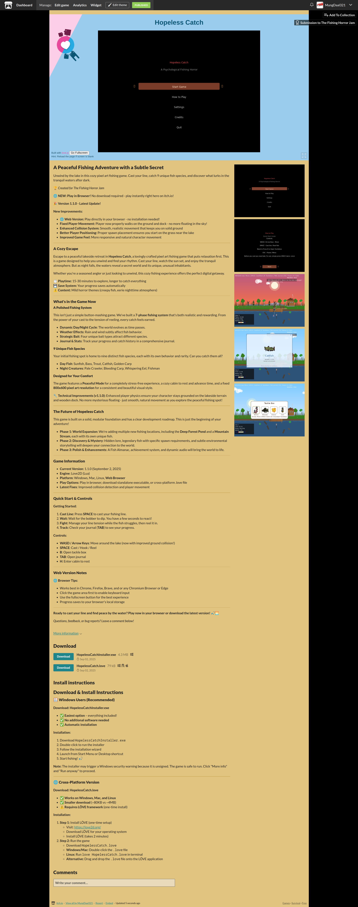

# Hopeless Catch - Fishing Horror Game

A fishing horror game built with LÖVE 2D, featuring procedurally generated landscapes and atmospheric gameplay.

## Project Versions

This repository contains multiple implementations of Hopeless Catch:

### 🎮 Web Version (WebAssembly) - Itch.io & Local
- **Location:** `Love2d_Web/`
- **Technology:** LÖVE 2D compiled to WebAssembly with love.js
- **Status:** ✅ Fully functional on itch.io and locally
- **Play Online:** [https://mungdaal321.itch.io/hopeless-catch](https://mungdaal321.itch.io/hopeless-catch)

#### Itch.io Upload Settings (Important!)

When uploading the web version to itch.io, use these exact settings:

**Upload Settings:**
- **Kind of project:** `HTML` — You have a ZIP or HTML file that will be played in the browser
- **Upload:** ZIP file from `Love2d_Web/dist/` folder

**Embed Options:**
- ✅ **Embed in page**
- ✅ **Manually set size**
- **Viewport dimensions:** `1280` × `720` px (fits everything properly)

**Frame Options:**
- ✅ **Mobile friendly** — Your project can run on mobile phones
- **Orientation:** Default
- ❌ **Automatically start on page load** — Leave unchecked (not recommended)
- ✅ **Fullscreen button** — Add a button to the bottom right corner
- ❌ **Enable scrollbars** — Leave unchecked
- ✅ **SharedArrayBuffer support** — REQUIRED! (Experimental) Enable this or the game won't run

**Theme Settings (for screenshots to display):**
- Go to **Edit Theme**
- Set **Screenshots** to **Show** (not Auto)

#### Itch.io Screenshots

**Start Menu**


**Gameplay**


**Catch Display**


**Tackle Box**


**How to Play**


**Full Game View**


#### Web Version Screenshots

**Start Menu**


**Gameplay**


**Catch Trophy**


**Pause Menu**


**Settings**


**How to Play**


### 🖥️ Desktop Version (LÖVE 2D)
- **Location:** `Love2d Version/`
- **Technology:** LÖVE 2D (Lua)
- **File:** `HopelessCatch.love`
- **Status:** ✅ Original version

### 🌐 HTML/CSS/JavaScript Version
- **Location:** `HTML_CSS_JS/`
- **Technology:** Vanilla JavaScript with HTML5 Canvas
- **Status:** ⚠️ Alternative implementation

### ⚛️ React/Tailwind Version
- **Location:** `Lovable/`
- **Technology:** React with Tailwind CSS
- **Status:** ⚠️ Alternative implementation

## Getting Started

### Run Locally (Desktop)
1. Install LÖVE 2D from https://love2d.org/
2. Download `Love2d Version/HopelessCatch.love`
3. Open with LÖVE 2D or run: `love HopelessCatch.love`

### Run Locally (Web)
The web version requires special HTTP headers (SharedArrayBuffer support). Use the included Python server:

```bash
# Navigate to the web version folder
cd Love2d_Web

# Start the local server (includes required COOP/COEP headers)
python3 serve.py

# Open in browser
# http://localhost:3000/
```

**Troubleshooting:**
- If the screen is blank, try refreshing the page
- Use Chrome, Firefox, or Edge for best compatibility
- Click the game area first to enable keyboard input
- Press the "Go Fullscreen" button for the best experience

**To stop the server:** Press `Ctrl+C` in the terminal

## Development

See the relevant README in each directory:
- [Love2d_Web/README.md](Love2d_Web/README.md) - Web development guide
- [HTML_CSS_JS/README.md](HTML_CSS_JS/README.md) - HTML/CSS/JS guide
- [Lovable/README.md](Lovable/README.md) - React guide

For detailed information about the web port, see [Love2d_Web/WEB_PORT_GUIDE.md](Love2d_Web/WEB_PORT_GUIDE.md)

## Technical Notes

### Web Port Requirements
The WebAssembly port requires SharedArrayBuffer support, which needs special HTTP headers:
- `Cross-Origin-Opener-Policy: same-origin`
- `Cross-Origin-Embedder-Policy: require-corp`

**Hosting Compatibility:**
- ✅ **itch.io** — Works! Enable "SharedArrayBuffer support" in embed options
- ✅ **Local Python server** — Works with included `serve.py`
- ❌ **GitHub Pages** — Does not support required headers
- ❌ **Netlify/Vercel (free tier)** — Does not support required headers

### Why LÖVE 2D?
LÖVE 2D was chosen for this project because:
- ✅ Consistent behavior across all desktop platforms (Windows, macOS, Linux)
- ✅ Simple, clean API for 2D game development
- ✅ Excellent for rapid prototyping and game jams
- ✅ Lightweight and performant
- ⚠️ Limited to 2D (3D requires additional libraries like Lovr)
- ⚠️ Web deployment requires Emscripten/love.js with header limitations

### Future Considerations
For projects requiring:
- **Multi-platform web deployment** - Consider web-native frameworks (Phaser 3, Babylon.js, Needle Engine)
- **3D support** - Consider Lovr (3D extension for LÖVE), Godot, or custom OpenGL/Vulkan
- **Universal codebase** - Consider frameworks like Nero.js that target multiple platforms from a single codebase

## Game Controls

| Action | Key |
|--------|-----|
| Move | WASD or Arrow Keys |
| Cast / Hook / Reel | SPACE |
| Open Tackle Box | B |
| Open Journal | TAB |
| Enter Cabin | H |
| Pause | ESC |

## Contributing

We welcome contributions! Please see [CONTRIBUTING.md](CONTRIBUTING.md) for guidelines.

## License

This project is licensed under the MIT License - see [LICENSE](LICENSE) file for details.

## Credits

- **LÖVE 2D:** https://love2d.org/
- **love.js:** https://github.com/Davidobot/love.js
- **Emscripten:** https://emscripten.org/

## Support

For issues, questions, or suggestions, please open an issue on GitHub.

---

🏆 *Created for [The Fishing Horror Jam](https://itch.io/jam/the-fishing-horror-jam)*

**Enjoy the game and happy fishing!** 🎣🌅
