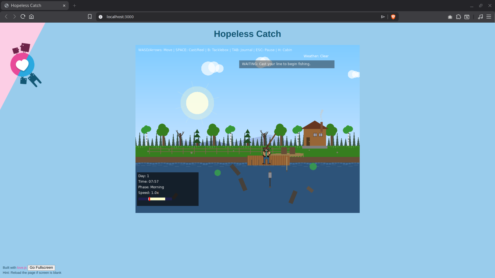
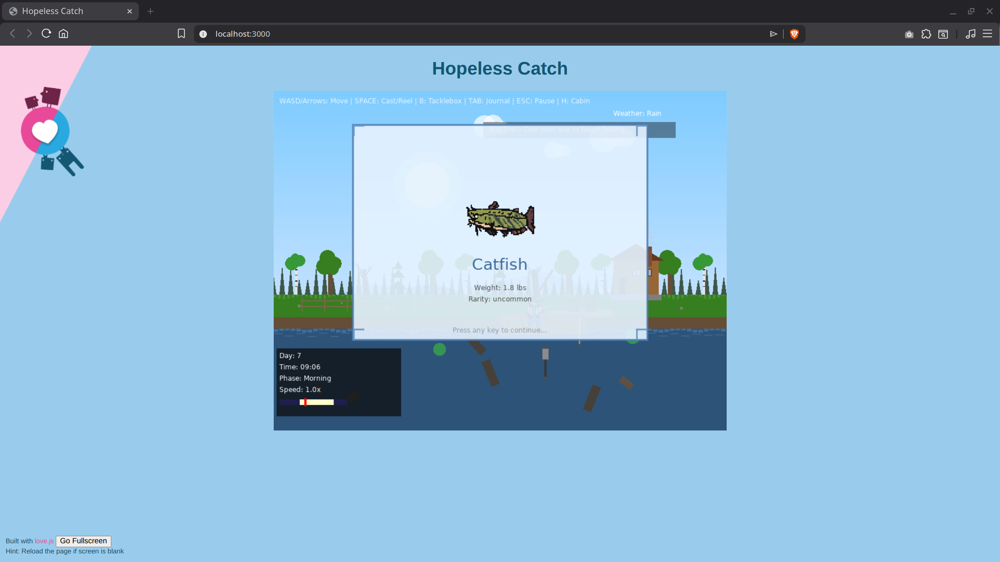
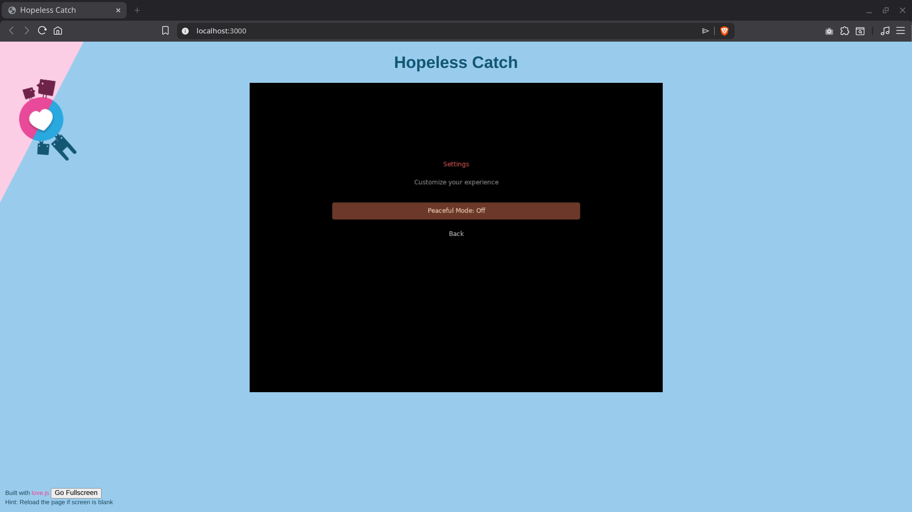
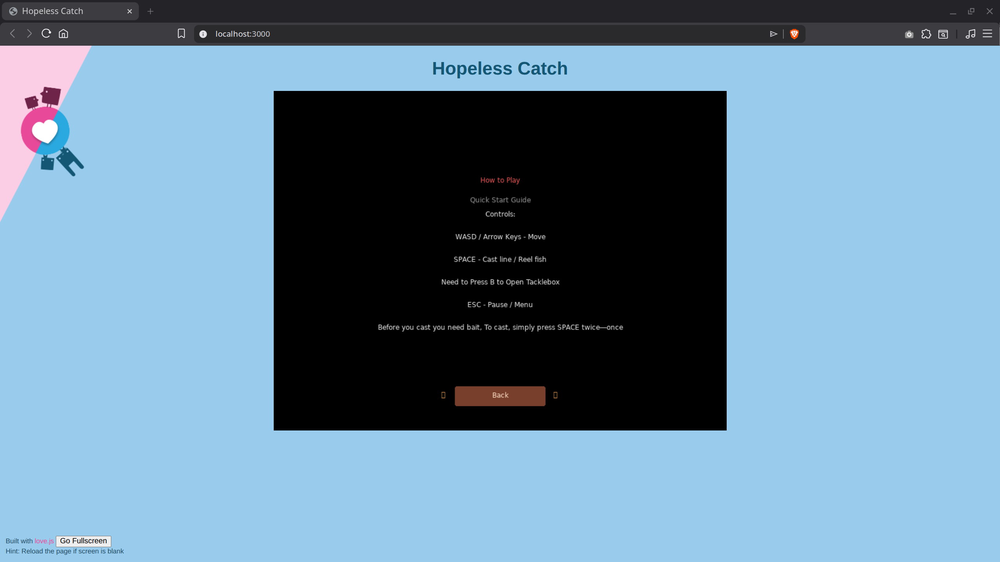

# Hopeless Catch - Fishing Horror Game

A fishing horror game built with LÖVE 2D, featuring procedurally generated landscapes and atmospheric gameplay.

## Project Versions

This repository contains multiple implementations of Hopeless Catch:

### 🎮 Web Version (WebAssembly) - Local Only
- **Location:** `Love2d_Web/`
- **Technology:** LÖVE 2D compiled to WebAssembly with love.js
- **Status:** ✅ Fully functional locally, identical to desktop version
- **Note:** Requires specific HTTP headers (COOP/COEP) for SharedArrayBuffer support. Works with local Python server but cannot be deployed to GitHub Pages, itch.io, or standard web hosting without custom header support.

#### Web Version Screenshots

**Start Menu**

**Gameplay**

**Catch Trophy**

**Pause Menu**

**Settings**

**How to Play**

### 🖥️ Desktop Version (LÖVE 2D)
- **Location:** `Love2d Version/`
- **Technology:** LÖVE 2D (Lua)
- **File:** `HopelessCatch.love`
- **Status:** ✅ Original version

### 🌐 HTML/CSS/JavaScript Version
- **Location:** `HTML_CSS_JS/`
- **Technology:** Vanilla JavaScript with HTML5 Canvas
- **Status:** ⚠️ Alternative implementation

### ⚛️ React/Tailwind Version
- **Location:** `Lovable/`
- **Technology:** React with Tailwind CSS
- **Status:** ⚠️ Alternative implementation

## Getting Started

### Run Locally (Desktop)
1. Install LÖVE 2D from https://love2d.org/
2. Download `Love2d Version/HopelessCatch.love`
3. Open with LÖVE 2D or run: `love HopelessCatch.love`

### Run Locally (Web)
1. Navigate to `Love2d_Web/`
2. Run: `python3 serve.py`
3. Open: http://localhost:3000/
4. Game will run perfectly with all features functional

## Development

See the relevant README in each directory:
- [Love2d_Web/README.md](Love2d_Web/README.md) - Web development guide
- [HTML_CSS_JS/README.md](HTML_CSS_JS/README.md) - HTML/CSS/JS guide
- [Lovable/README.md](Lovable/README.md) - React guide

For detailed information about the web port, see [Love2d_Web/WEB_PORT_GUIDE.md](Love2d_Web/WEB_PORT_GUIDE.md)

## Technical Notes

### Web Port Limitations
The WebAssembly port of Hopeless Catch works identically to the desktop version when run locally with proper HTTP headers. However, it cannot be deployed to standard web hosting (GitHub Pages, itch.io, Netlify, Vercel) due to SharedArrayBuffer security requirements that need:
- `Cross-Origin-Opener-Policy: same-origin`
- `Cross-Origin-Embedder-Policy: require-corp`

These headers are not supported by free hosting platforms. The game works perfectly with the included local Python server.

### Why LÖVE 2D?
LÖVE 2D was chosen for this project because:
- ✅ Consistent behavior across all desktop platforms (Windows, macOS, Linux)
- ✅ Simple, clean API for 2D game development
- ✅ Excellent for rapid prototyping and game jams
- ✅ Lightweight and performant
- ⚠️ Limited to 2D (3D requires additional libraries like Lovr)
- ⚠️ Web deployment requires Emscripten/love.js with header limitations

### Future Considerations
For projects requiring:
- **Multi-platform web deployment** - Consider web-native frameworks (Phaser 3, Babylon.js, Needle Engine)
- **3D support** - Consider Lovr (3D extension for LÖVE), Godot, or custom OpenGL/Vulkan
- **Universal codebase** - Consider frameworks like Nero.js that target multiple platforms from a single codebase

## Contributing

We welcome contributions! Please see [CONTRIBUTING.md](CONTRIBUTING.md) for guidelines.

## License

This project is licensed under the MIT License - see [LICENSE](LICENSE) file for details.

## Credits

- **LÖVE 2D:** https://love2d.org/
- **love.js:** https://github.com/Davidobot/love.js
- **Emscripten:** https://emscripten.org/

## Support

For issues, questions, or suggestions, please open an issue on GitHub.

---

**Enjoy the game and happy fishing!
